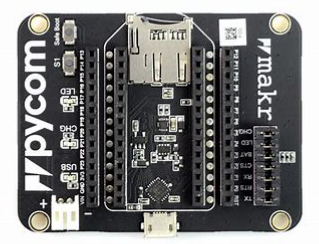
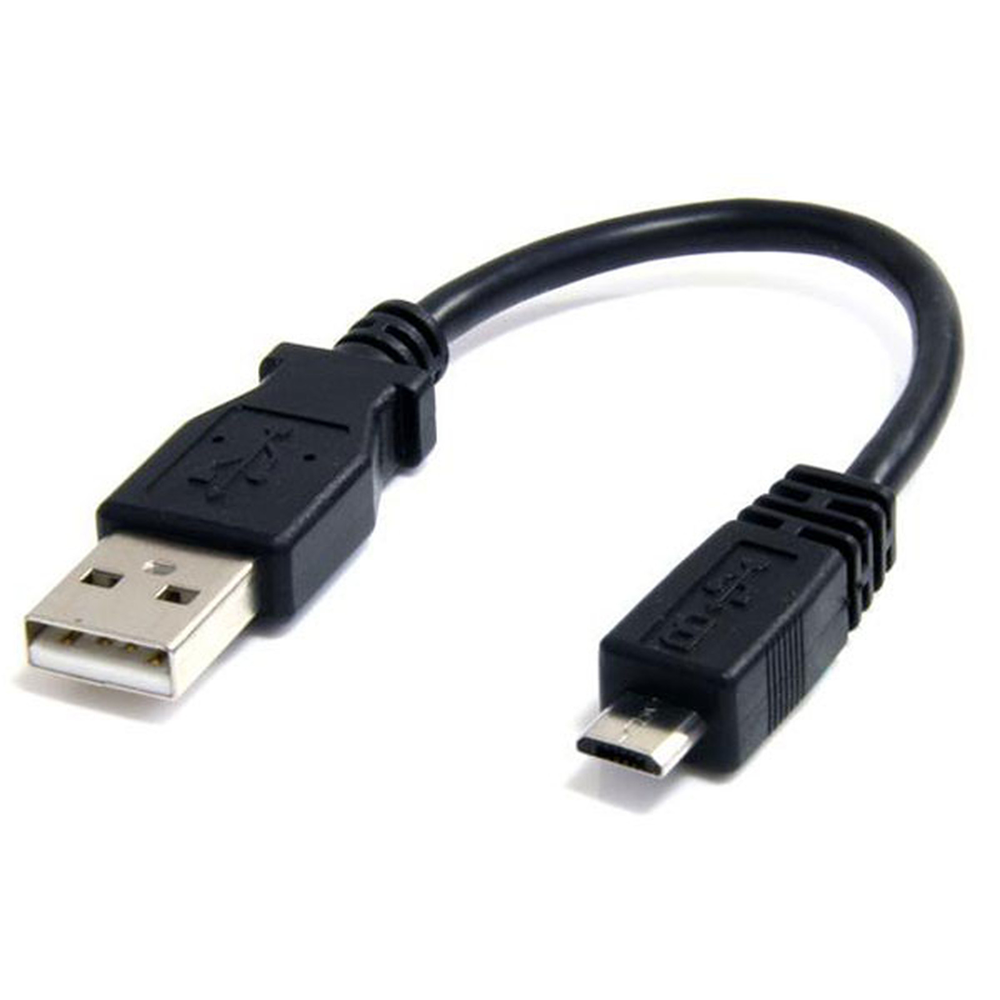
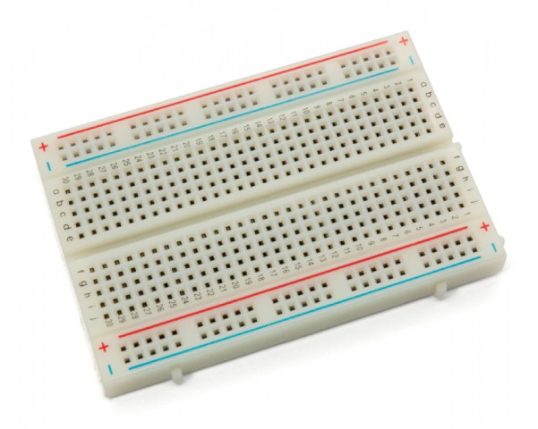
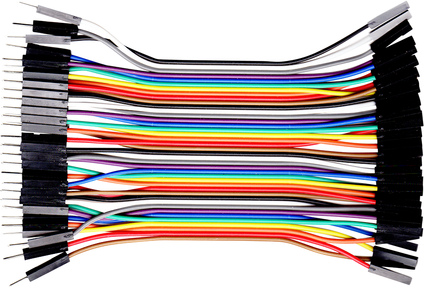
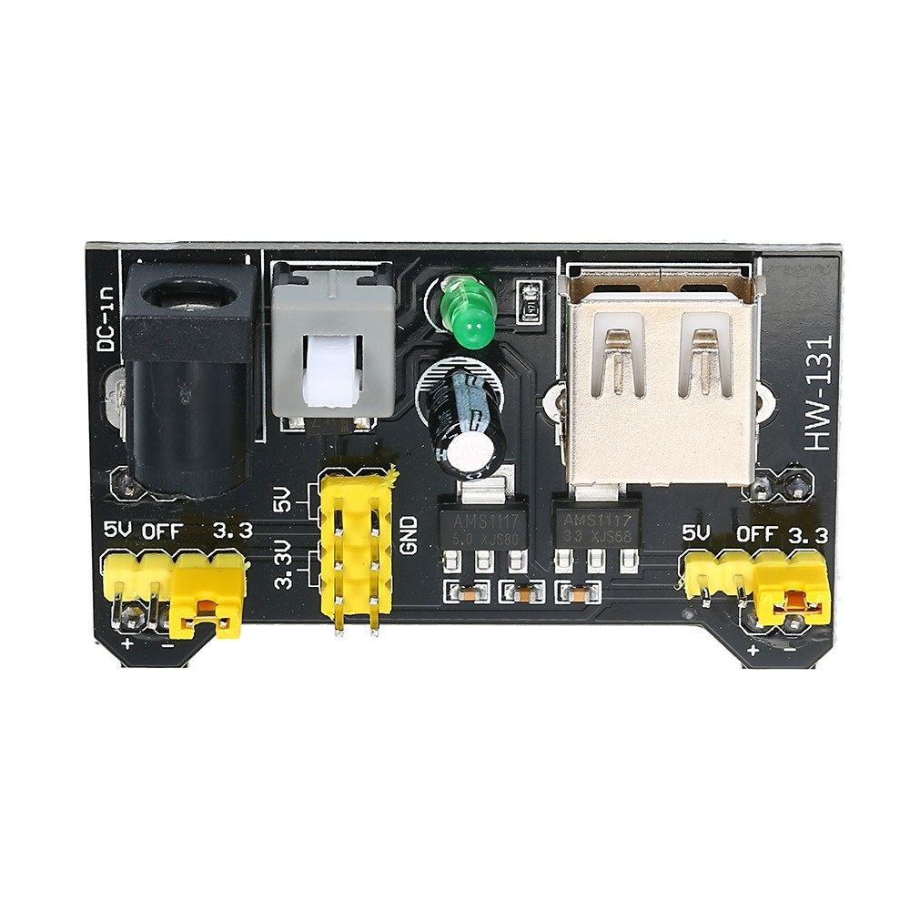
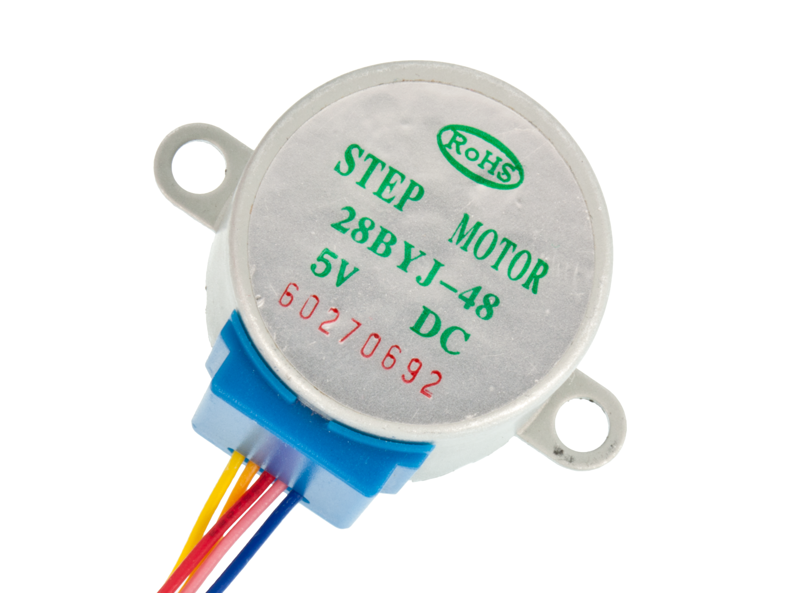
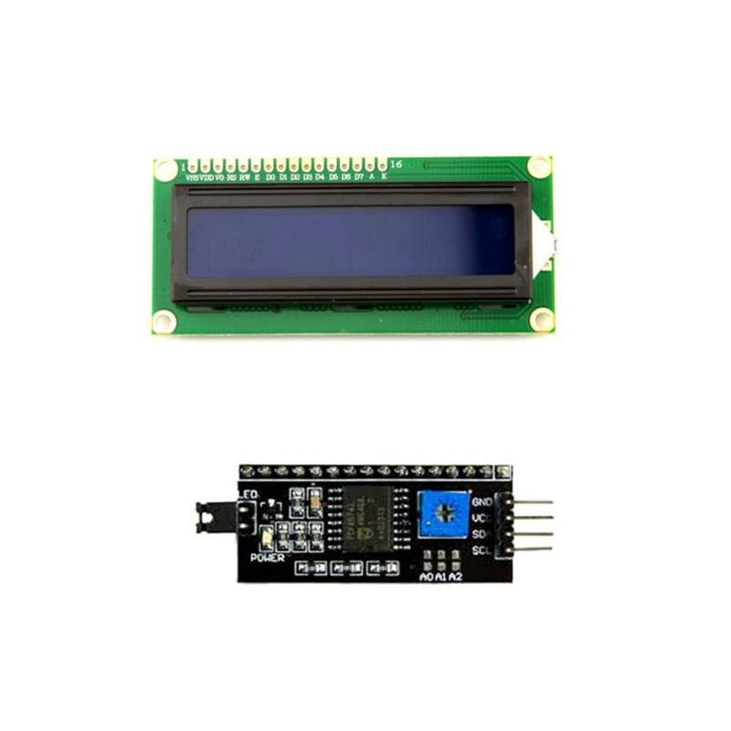
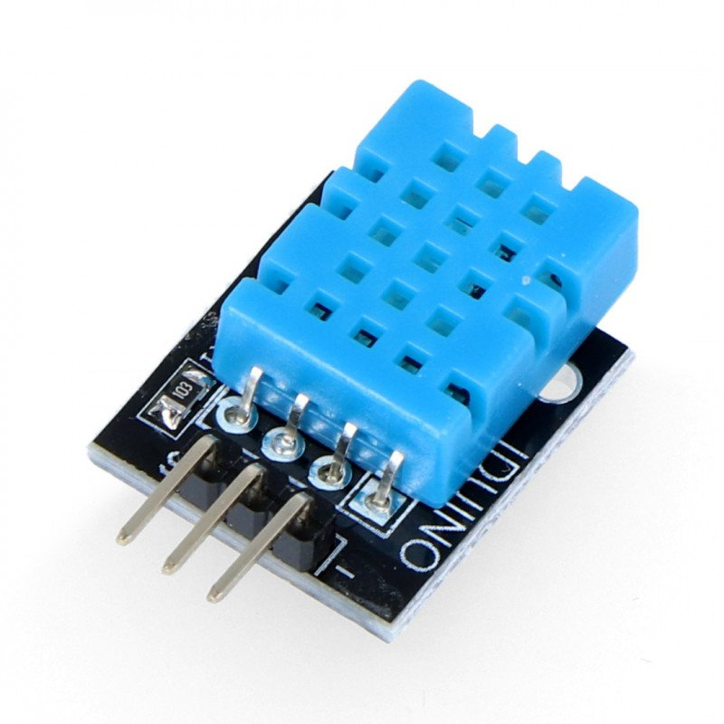

# Aquarium monotring 
Group members: Emad Ali, Kemal Cikota, Hallak Mohammedanas, Yousef Mohammad

Program: Master of science in software technology and technical mathematics

Course: 1DT902

Supervisor/Teacher : Fredrik Ahlgren and Lars Karlsson

___

## Abstract

There has not been alot of things more relevant and quick in growth quite like the art of programming in the past 10-20 years. As new methods, languages and ways to adapt programming in a physicall form get further developed. New nisches start to rise which gets the general public moving and as it grows and grows more people get interested. The microcontroller has for a long time been a nisch in the software space that a group of students from the Linneaus university has made their goal to master the art of microcontroller-programming. The group has for a long time faced a dilemma, 3 of 4 members in the group has an aquarium at home with pet fish and as many know it can be quite hard to take care of the fish while away from home. The group has made it their main goal to fully develope a system that feeds and maintains the health of the fish while away from home.

## Background and idea

The idea for the project originated from a need to maintain the health of the fish while not at home. As they aren't as needy as dogs or cats they definetly need some sort of maintenance. The group quickly identified key data that an owner needs to determine what the fish need to be healthy; humidity, the deapth of the water and ofcourse the food that they eat.

The group wanted to create a system that dispenses food to the fish automatically but also reads the information and presents it in a way that is easy for the user to identify.

The point of this project is to use knowledge acquired during our short but intuitive time in the university and tools that the group have learned to use. The group will also extend and develope their knowledge to use it in future courses and projects.

## Method and Material

To create the aquarium monitoring device the following hardware is needed :

| Component                                                      | Count | Specification | Picture |
|---------------------------------------------|:-----:|:------|---------|
| LoPy4                                                          |   x1  |A micropython micro controller that have difference communication ways: <br>WIFI, LoRa, Sigfox, Bluetooth ||
| Expansion board v3.1                                           |   x1  |Compatible with Pycom’s WiPy, LoPy, SiPy, FiPy, and GPy development boards. Needed to program and power the LoPy4 board.||
| Micro USB cable                                                |   x1  |Allows you to connect to your micropython with computer for programming.||
| Breadboard                                                     |   x1  |A board wich you can make electical circuit without soldering||
| Cable(male&female)                                             |x25| Used for connectionen bwetween the LoPy4 and the breadvoard||
| 9V battery(And AC/DC adapter cable)                            |   x1  |Used to run the power supply||
| Power suppley (HW-131)|   x1  |Allowed you to give power to the componetes||
| Stepper motor(28BYJ-48)                                        |   x1  |Motor that rotat with a given torque||
| Stepper motor driver (ULN2003)                                 |   x1  |Controll the speed of the motor ||
| 16x2 LCD display (with i2c interface adapter,PCF8574T)         |   x1  |Show the data from the different sensors||
| Ultrasonic ranging sensor (HC-SR04)                            |   x1  |Measure the water level in the aquarium||
| 1000 Ohm resistors                                             |   x2  |Used to reduce the voltage flow to the components||
| Digital temperature sensor (DHT-11 with integrated resistance) |   x1  |Read the temprature||


To build and put the aquarium monitoring device together the following must be done :

Full tutorial on how to connect every separate component is in the [Hardware.md](https://gitlab.lnu.se/1dt308/student/grupp-4---aquarium-monitoring/project/-/blob/main/Text_files/hardware.md) documentation.

1. **Connecting the PyCom**

    If not already done, put the LoPy4 microcontroller head on the PyCom expansion board and connect it to your cable using the USB cable that comes with it (**NOTE: Do NOT have the PyCom device connected to a computer while connecting different components in it's sockets.**)

2. **Temperature sensor (DHT-11)**

    The DHT-11 has 3 pins on it which all are self explanotory to connect. It has a negative, positive and a signal pin. In our case we assigned the negative to GND, positive to 3v3 and the signal to P23

3. **Ultrasonic Ranging sensor (HC-SR04)**

    The Ranging sensor has four pins on it and it has to be connected to the PyCom via breadboard. This will also need the use of resistors to avoid any damage to the PyCom. It is to be connected in the following way :

    

4. **Stepper-Motor (28-BYJ48)**
    To make the stepper motor work we need two extra components : A driver (ULN2003) and a power supply (HW-131) paired with a 9V battery. An illustration on how to connect it : 

    

5. **LCD (16x2)**
    For this to work efficiently without much room for error the group strongly suggests using a screen with an i2c adapter on the back of it, this makes it easier to connect to the PyCom but it also looks less confusing and saves sockets on the Pycom. It needs a 5V power source, GND and then it needs to have Clocking (SCL) and data (SDA) connected to Pin 9 and 10.


### Computer/Software setup

1. **Expansion board firmware update:**

    The expansion board does not need to be updated if it is a V3.0 or V3.1. if the LoPy device has an older expansion board then it can be updated by following this [Guide](https://github.com/pycom/pycom-libraries/tree/master/lib).

2. **Device firmware update**

    To avoid experiencing bugs or glitches especially with the IoT enviroment, Adafruit. A firmware update on the device has to be made and it can be found [here](https://docs.pycom.io/updatefirmware/device/).

3. **Installing an IDE :**

    To run or potentially modify the code in this project an IDE is needed. There are different IDE's to choose from but the group chose to use VSCode because it was an enviroment that the group were used to.

    Following this step a PyMaker plugin is also needed. A guide on how to do download and run the PyMaker plugin can be found in the groups [documentation](https://gitlab.lnu.se/1dt308/student/grupp-4---aquarium-monitoring/project/-/blob/main/Text_files/Setup.md).

### IoT Setup 

To be able to transmit data and visualise it a connection to a IoT platform is needed. Since there was no LoRa gate near the groups proximity the data is beeing sent to the IoT cloud via WiFi. The group chose Adafruit as their platform because it was the easiest to adopt to the LoPy4. To see a full guide on the process look at the group's [documentation](https://gitlab.lnu.se/1dt308/student/grupp-4---aquarium-monitoring/project/-/blob/main/Text_files/Setup.md). The group made it look like this : 

### Code

After doing all of the above steps the code is the last piece of the puzzle. Download the [Code](https://gitlab.lnu.se/1dt308/student/grupp-4---aquarium-monitoring/project/-/tree/main/code) folder in the groups repository and open it up in VSCode. There should be a **"Main.py"** and a lib folder with all the libraries needed for the projects components, this includes : **"dth.py", "stepper.py", "esp8266_i2c_lcd.py" and "lcd_api.py"**. dth.py was used for the dth-11 temperature sensor and stepper.py was used for the stepper motor driver. esp8266_i2c_lcd.py is the library for the lcd screen and this is vital for the screen as it makes the i2c adapter work correctly. screens without i2c adapters don't need this library.

1. **Main.py :**

```
from time import sleep_ms, ticks_ms, ticks_diff
import Stepper
from machine import Pin, I2C
from esp8266_i2c_lcd import I2cLcd
from dth import DTH
import utime
import pycom
import machine
# main.py -- put your code here!
from mqtt import MQTTClient
# from mqtt import MQTTClient_lib as MQTTClient
from network import WLAN
import time


# Wireless network
WIFI_SSID = "Mi"
WIFI_PASS = "65yryr"


# Adafruit IO (AIO) configuration
AIO_SERVER = "io.adafruit.com"
AIO_PORT = 1883
AIO_USER = "ea224"
AIO_KEY = "aio_LJRv03mGN8hG4GtaEJMs0kHQwKiG"
AIO_CONTROL_FEED = "ea224/feeds/button"
AIO_TEMP_FEED = "ea224/feeds/temperature"
AIO_RANGING_FEED = "ea224/feeds/ranging"
AIO_MOTOR_FEED = "ea224/feeds/motor"
# RGBLED
# Disable the on-board heartbeat (blue flash every 4 seconds)
# We'll use the LED to respond to messages from Adafruit IO
pycom.heartbeat(False)
time.sleep(0.1) # Workaround for a bug.
                # Above line is not actioned if another
                # process occurs immediately afterwards
pycom.rgbled(0xff0000)  # Status red = not working

# WIFI
# We need to have a connection to WiFi for Internet access
# Code source: https://docs.pycom.io/chapter/tutorials/all/wlan.html

wlan = WLAN(mode=WLAN.STA)
wlan.connect(WIFI_SSID, auth=(WLAN.WPA2, WIFI_PASS), timeout=5000)

while not wlan.isconnected():    # Code waits here until WiFi connects
    machine.idle()

print("Connected to Wifi")
pycom.rgbled(0xffd7000) # Status orange: partially working
time.sleep(3)

pycom.heartbeat(False)


RANDOMS_INTERVAL = 5000 # milliseconds
last_random_sent_ticks = 0  # milliseconds


def sub_cb(topic, msg):
    print(msg)
    if msg == b"1":             
        client.publish(topic="ea224/feeds/motor", msg="Motor are spinning")
        mashine()
    


def send_temp():
    global last_random_sent_ticks
    global RANDOMS_INTERVAL
    global x
    if ((time.ticks_ms() - last_random_sent_ticks) < RANDOMS_INTERVAL):
        return; # Too soon since last one sent.
    else:
        print("Publishing: {0} to {1} ... ".format(x, AIO_TEMP_FEED), end='')
        try:
            client.publish(topic=AIO_TEMP_FEED, msg=str(x))
            client.publish(topic=AIO_RANGING_FEED, msg=str(diss))
            print("DONE")
        except Exception as e:
            print("FAILED")
        finally:
            last_random_sent_ticks = time.ticks_ms()


def spined():
    client.publish(topic=AIO_MOTOR_FEED, msg="Motor spinned")


s1 = Stepper.create(Pin("P23", mode=Pin.OUT),Pin("P22", mode=Pin.OUT),Pin("P21", mode=Pin.OUT),Pin("P20", mode=Pin.OUT), delay=3)
last_time = ticks_ms() # save current time
delay = 2 # 2 sec
x = 0 # temp value
displayed_value = 0
diss = 0

# initialise Ultrasonic Sensor pins
echo = Pin("P18", mode=Pin.IN)
trigger = Pin("P19", mode=Pin.OUT)
trigger(0)


# Ultrasonic distance measurment
def distance_measure():
    # trigger pulse LOW for 2us (just in case)
    trigger(0)
    utime.sleep_us(2)
    # trigger HIGH for a 10us pulse
    trigger(1)
    utime.sleep_us(10)
    trigger(0)

    # wait for the rising edge of the echo then start timer
    while echo() == 0:
        pass
    start = utime.ticks_us()

    # wait for end of echo pulse then stop timer
    while echo() == 1:
        pass
    finish = utime.ticks_us()

    # pause for 20ms to prevent overlapping echos
    utime.sleep_ms(20)

    # calculate distance by using time difference between start and stop
    # speed of sound 340m/s or .034cm/us. Time * .034cm/us = Distance sound travelled there and back
    # divide by two for distance to object detected.
    distance = ((utime.ticks_diff(start, finish)) * .034)/2
    pos_distance = abs(distance)

    return pos_distance


def distance_median():

    # initialise the list
    distance_samples = []
    # take 10 samples and append them into the list
    for count in range(10):
        distance_samples.append(int(distance_measure()))
    # sort the list
    distance_samples = sorted(distance_samples)
    # take the center list row value (median average)
    distance_median = distance_samples[int(len(distance_samples)/2)]
    # apply the function to scale to volts
    return int(distance_median)

def tempo():
    global x
    th = DTH(Pin('P3', mode=Pin.OPEN_DRAIN),0)
    result = th.read()
    if result.is_valid():
        x= result.temperature
    print("x",x)


#lcd
# The PCF8574 has a jumper selectable address: 0x20 - 0x27
DEFAULT_I2C_ADDR = 0x27

def LCD():
    global displayed_value
    i2c = I2C()
    lcd = I2cLcd(i2c, DEFAULT_I2C_ADDR, 2, 16)
    lcd.putstr("The Temperature is\n \t "+ str(x))
    displayed_value = x

#if __name__ == "__main__":
def mashine():
    global x
    global displayed_value
    global diss
    global last_time
    global delay
    while True:
        if(ticks_diff(ticks_ms(), last_time) > delay):
            print("step...",end=" ")
            s1.step(125) # or s1.step(-100)
            print("stepped")
            last_time = ticks_ms()
            tempo() # send th
            diss = distance_median()  
            send_temp()
            spined()
            if displayed_value != x :
                LCD()
        else:
            tempo()
            send_temp()
            diss = distance_median()
            if displayed_value != x :
                LCD()
client = MQTTClient("ea224pn", AIO_SERVER,user = AIO_USER,password= AIO_KEY, port = AIO_PORT)
client.set_callback(sub_cb)
client.connect()
client.subscribe(topic=AIO_CONTROL_FEED)

while True:
    client.check_msg()
    time.sleep(2)
#     time.sleep(2) cant use that cuse the phone charger stop outputing
#s1.step(100)
    
#s1.angle(180)
#s1.angle(360,-1) # or s1.angle(-360)

```

## Result

After 1 month of hard work the group was able to finalize a product that they would feel proud to showcase and present to a teacher. The group was from the beginning very adament on what they wanted to acheive and accomplish in this project. Some things did change while the group worked but it was all because of the groups flexibillity and will to self critisize. The felixibility and self critique made the group motivated and willing to also self improve as trial and error is a big part of the learning curve not only when it comes to programming but also when it comes to thinking like an engineer. 

The group wanted to create something that could be of good use in the daily life and because two of the four members faced similar problem with taking care of their fish it was a clear choice to choose the project that was chosen.

Because the group already had a base foundation of what sensors were needed it wasn't so hard to split up the work. The group started early with scaling and creating prints for the plastic structure because each print and each component took several hours to print out. The printing consisted of three major parts : A funnel that would work as a reservoir for the food, A screw that would push the food out from the reservoir, very simillar to a "archimedes screw" and the base structure that would hold everything together. The first set of prints looked decent when looking at the quality of the durability individually but there were problems with them not holding proportions to each other, the screw was for example too short to push food out but after 2 weeks the group finally had a fully printed set of pieces that all fitted together smoothly, it can be seen in [this](https://www.youtube.com/watch?v=8pZed-gAdZE) video.

After having prints that all fitted together and worked manually we started to work on the components that would make this an autonomous device. The group started by first putting together code from the DHT-11 in a the main.py file, this was easy because the majority of the work was already done from labs that the group had completed previously in the course. The next step was to get the LCD to work and make the values from the DHT-11 get printed on the LCD. This was partially easy to do because the LCD had a i2c adapter that allowed the group to be conservative with the amount of cables needed to connect the LCD, look at [Hardware.md](https://gitlab.lnu.se/1dt308/student/grupp-4---aquarium-monitoring/project/-/blob/main/Text_files/hardware.md). Finding a library for the LCD on the other hand was not necesarilly difficult but it was hard to modify so it would work for the interface on the PyCom as some functions that come with the standard micropython interface doesen't fully apply on PyCom. After this the group decided to make the screw rotate and this was done in three parts. The group had to connect a driver for the motor, the motor itself and a power supply. The group realised that a power supply was needed as the maximum voltage output from the was 5V and it wasn't enough to make the screw do a smooth full rotation while operating and because this was the main function of the project the group decided to use a power supply together with a 9V battery to get a stronger output which would make the screw do rotations smoother, more precisely and reliably. After the stepper motor was done the only thing left hardware-wise was the ultrasonic ranging sensor. This was quite easy to implement as the group didn't have to go look for librarys for it to run properly. At this stage the project had it's main features done and it looked something like [this](https://www.youtube.com/watch?v=WaY2WB116yU).

When the sensors were all in place we all put our time on the IoT and after alot of trial and error the group finally had a complete and finnished product and it looked like this [this](https://www.youtube.com/watch?v=lWsee23ow4o).

(**NOTE :** The device could unfortunatly not be tested live on the aquarium as the fish had just started laying eggs so the aquarium had to be emptied out and evaquated to make sure the eggs would survive and develop safely.)

## Discussion

This chapter will include personal statements and how the group thought the project went after it was done. This will also include a discussion regarding how the group made their decisions and what they based their decision making on.

**General discussion :**

Even though the group did make some changes to the project the overall impression is perfect, the group did, in the bigger picture do everything that they wanted to do and the group is happy and proud to present this project. 

The group did have 2 major changes when it came to the hardware of the project. Firstly they decided to not install a RGB-Led telling us the status of the aquarium and there were multiple points of reasoning for this decision :
1.  The point of the project was to be able to have the fish fed while not at home so the point of an RGB-led telling a status would only work when at home, observing the aquarium.
2. We already had an LCD telling us all the information given by the sensors and with more information than an RGB would. The LCD can for example tell us the exact temperature, the RGB can not.

The second major change was the use of a humidity sensor and this is a reasonable change considering that the humidity sensor would be completely useless in a water filled tank where the humidity is always high above average.

The third change is the use of a PH sensor and this is something that the group wished to include in the project but unfortunetly didn't have enough time to do so. The group spent more time then expected on the IoT so we had to exclude the PH-Sensor. On second thought the group would rather exclude the ranging sensor and keep the PH-sensor in the plan as PH-Levels is more important data.

The group felt like they met the standards they wanted to keep considering that no one had any major experience in microcontroller programming prior to this course. The group ended up spending south of 100 hours combined excluding the time it took for the printers to print our parts.

**Personal statements :**

- **Kemal :**

    The group had immaculate chemistry and every member contributed very well to the project. The group chose to communicate over discord and meet almost everyday during the course of the project to make sure that the project would keep a good standard and grant the group a good grade. The project was alot of fun because i felt like we did something that is practicall and can be used even after the project is done. I am very happy with how the project turned out and look forward to future projects.

- **Yousef :**

    We as a grupp had very good team work, I feel like I got more knowledge about coding, but also hardware. Before we began with this project I didn't know anything about how hardware works or microcontrollers but now I feel like I have some knowledge about it. It was very difficult to know how I should begin with research, what I should look for and so on but we made it as a grupp. We could work together every day when we needed but even sometimes when we worked at home we could call each other and ask if someone could help with anything we needed help for.

- **Emad :**

    My personal statments over the project are that every body made a great job, even if we got some issues during the projekt but we could solve them together, for me it was a little bit difficult in the begning with the IoT part, because we decided to make an app to get and send data to LoPy4. After making the app using mit app inventor, we could send data to the micropython but we could not get data from the pycom. So we did the IoT part instead with adafruit and it works well as we want.

- **Anas :**
    I think the project went smoothly mostly thanks to consistent communication between the members of the group over discord. One of the things I learned is that if you are coding and something isn't working then it's a good strategy to "ruberduck" with someone else from the group because it might be a simple mistake that isn't obvious at first glans.  It was a great experience to create a prototype and test it, the process of problem solving and designing is two skils that I think are really important to master in order to create other projects in the the future. 


____

**documentation :**

* [requirments.md](https://gitlab.lnu.se/1dt308/student/grupp-4---aquarium-monitoring/project/-/blob/main/Text_files/Requirements.md)
* [Setup.md](https://gitlab.lnu.se/1dt308/student/grupp-4---aquarium-monitoring/project/-/blob/main/Text_files/Setup.md)
* [Timelog.md](https://gitlab.lnu.se/1dt308/student/grupp-4---aquarium-monitoring/project/-/blob/main/Text_files/Timelog.md)
* [Hardware.md](https://gitlab.lnu.se/1dt308/student/grupp-4---aquarium-monitoring/project/-/blob/main/Text_files/hardware.md)
* [Test.md](https://gitlab.lnu.se/1dt308/student/grupp-4---aquarium-monitoring/project/-/blob/main/Text_files/test.md)

* [Video-Presentation](https://www.youtube.com/watch?v=Cl_TG4AYzxQ)
